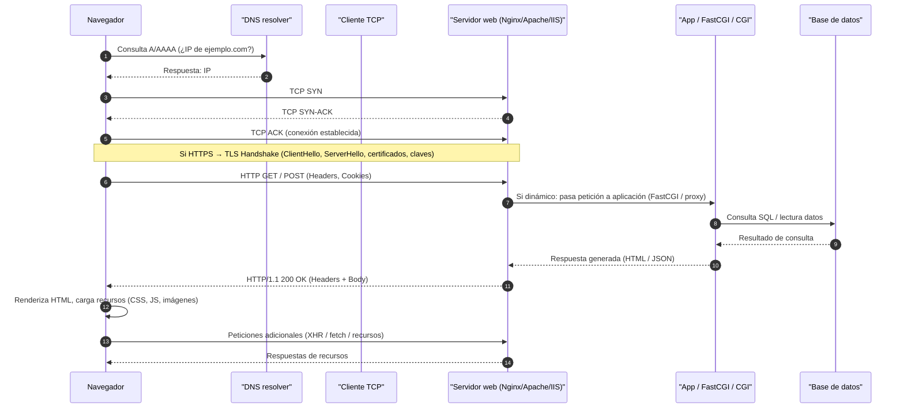

# Asesoramiento para Publicación de la Primera Web (Tienda Local)

## Resumen

Este proyecto documenta la propuesta para publicar la primera página web de una tienda local. Contiene el análisis de arquitectura, la decisión sobre tipología (estática o dinámica), la selección del servidor web (Apache, Nginx o IIS), explicación del protocolo HTTP y recomendaciones de seguridad y mantenimiento.

## Contenido del repositorio

- `README.md` — este documento.
- `diagrama-mermaid.md` — diagrama Mermaid del flujo HTTP (incluido en sección abajo).
- `ejemplo/` — (opcional) plantillas de configuración y aplicación de ejemplo (Nginx + app).

## Análisis de Arquitectura

- Modelo: cliente-servidor. El navegador actúa como cliente y el servidor web atiende peticiones HTTP/HTTPS.
- Componentes necesarios: DNS, balanceador/reverse-proxy (opcional), servidor web (`Nginx`/`Apache`/`IIS`), motor de aplicación (PHP-FPM, Node.js, ASP.NET), base de datos (MySQL/Postgres/SQL Server), almacenamiento de ficheros, certificados TLS, sistema de logs y backups.

## Tipología: Estático vs Dinámico

- Recomendación para tienda local: **sitio dinámico** si se necesita catálogo interactivo, búsqueda, carrito, usuarios o integración con inventario y pagos.
- Usar **sitio estático** únicamente para páginas informativas sin lógica de negocio (más simple y seguro).

## Selección Tecnológica

- Recomendación principal: **Nginx** como servidor frontal y reverse-proxy (si infraestructura Linux/contenerizada).
- Motivos: arquitectura event-driven (mejor manejo de conexiones concurrentes), eficiente para servir estáticos y proxy hacia backends; configuración TLS y mitigaciones de tasa sencillas.
- Alternativas: `Apache` (flexible, `.htaccess`), `IIS` (entorno Windows / ASP.NET).

## Funcionamiento del Protocolo HTTP (resumen)

1. Resolución DNS → obtención de IP.
2. Establecimiento de conexión TCP (SYN / SYN-ACK / ACK).
3. Si HTTPS → handshake TLS (ClientHello / ServerHello / certificado).
4. Envío de petición HTTP (método, URI, headers, body opcional).
5. Servidor sirve recurso estático o pasa petición al motor de aplicación (FastCGI / proxy).
6. Aplicación consulta BD si procede y genera respuesta.
7. Servidor envía respuesta con código de estado y headers.
8. Cliente renderiza y solicita recursos adicionales.

## Diagrama del flujo HTTP (Mermaid)



## Seguridad y Mantenimiento (acciones concretas)

- Mantener actualizaciones del SO, servidor web y runtimes; planear ventanas de mantenimiento.
- TLS obligatorio: certificados automáticos (Let's Encrypt), configurar CIPHER suites seguros y HSTS.
- Backups automáticos de BD y ficheros; backups offsite y pruebas de restauración.
- Firewall: abrir sólo puertos necesarios (80/443), usar `fail2ban`/IPS.
- Principio de menor privilegio: ejecutar servicios con cuentas limitadas.
- Centralizar logs y configurar alertas (errores 5xx, spikes, caídas).
- Versionado de la configuración del servidor en control de versiones privado.

## Despliegue mínimo de ejemplo (Nginx + Node.js)

1. Instalar dependencias en servidor Linux (ejemplo Ubuntu):

```bash
sudo apt update
sudo apt install -y nginx nodejs npm
```

2. Configurar `systemd` para la app Node (ejemplo mínimo):

```bash
# crear archivo /etc/systemd/system/miapp.service
# contenido: ejecutar node /var/www/miapp/index.js como servicio
sudo systemctl enable --now miapp.service
```

3. Ejemplo de bloque de sitio Nginx (en `/etc/nginx/sites-available/miapp`):

```nginx
server {
    listen 80;
    server_name ejemplo.com www.ejemplo.com;

    location / {
        proxy_pass http://127.0.0.1:3000;
        proxy_set_header Host $host;
        proxy_set_header X-Real-IP $remote_addr;
    }
}
```

4. Activar sitio y recargar Nginx:

```bash
sudo ln -s /etc/nginx/sites-available/miapp /etc/nginx/sites-enabled/
sudo nginx -t && sudo systemctl reload nginx
```

## Checklist de puesta en producción

- [ ] Configurar DNS y registrar A/AAAA.
- [ ] Configurar TLS y renovar automáticamente (Certbot / ACME).
- [ ] Revisar permisos y usuarios de servicios.
- [ ] Programar backups y verificar restauraciones.
- [ ] Configurar monitorización y alertas.
- [ ] Realizar pruebas de carga y seguridad básicas.

## Cómo seguir

Si quieres, puedo generar la carpeta `ejemplo/` con la app Node mínima, la configuración de `Nginx` y scripts de backup, o exportar este `README.md` a PDF/Presentación.

---
Proyecto entregado: informe y diagrama listos.
