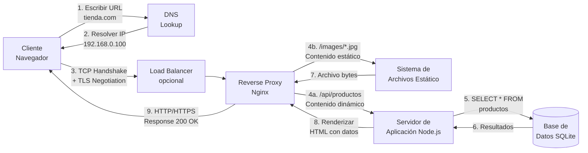

# WebStack: Diseño de Infraestructura para el Despliegue de Servicios Web

## 📋 Contenido

1. **Análisis de Arquitectura**
2. **Tipología de Web**
3. **Selección Tecnológica**
4. **Funcionamiento del Protocolo HTTP**
5. **Seguridad y Mantenimiento**
6. **Diagrama del Flujo HTTP**

---

## 1. Análisis de Arquitectura: Modelo Cliente-Servidor

### 1.1 Componentes Principales

El modelo cliente-servidor para una aplicación web dinámica consta de los siguientes elementos:

#### **Cliente (Navegador)**
- Envía peticiones HTTP/HTTPS
- Renderiza HTML, CSS y ejecuta JavaScript
- Gestiona sesiones de usuario mediante cookies
- Valida datos en el lado del cliente

#### **Servidor Web (Nginx)**
- **Función:** Actúa como reverse proxy y servidor frontal
- Recibe peticiones HTTP/HTTPS en los puertos 80/443
- Enruta tráfico a servidores de aplicación
- Comprime respuestas (GZIP)
- Sirve contenido estático
- Implementa caché para mejor rendimiento
- Valida cabeceras de seguridad

#### **Servidor de Aplicación (Node.js + Express)**
- Ejecuta lógica de negocio
- Procesa peticiones dinámicas
- Interactúa con la base de datos
- Genera respuestas personalizadas

#### **Base de Datos (SQLite / PostgreSQL / MySQL)**
- Almacena datos persistentes
- Gestiona consultas complejas
- Asegura integridad de datos

#### **Almacenamiento de Ficheros**
- Guarda imágenes de productos
- Archivos de configuración
- Backups

#### **Sistema de Monitorización**
- Logging de accesos y errores
- Health checks
- Alertas de rendimiento

### 1.2 Flujo de Comunicación

```
CLIENTE (Browser)
        ↓
    DNS Lookup
        ↓
    TCP Handshake (3-way)
        ↓
    TLS Negotiation (para HTTPS)
        ↓
    HTTP Request (GET, POST, PUT, DELETE)
        ↓
    REVERSE PROXY (Nginx)
        ├→ ¿Contenido Estático? → Caché/Almacenamiento
        └→ ¿Petición Dinámica? → Servidor de Aplicación
        ↓
    APP SERVER (Node.js)
        ├→ Procesar lógica
        └→ Consultar DB
        ↓
    HTTP Response (HTML, JSON)
        ↓
    CLIENTE (Renderizar)
```

---

## 2. Tipología de Web: ¿Estática o Dinámica?

### 2.1 Requisitos del Cliente (Tienda Online)

Para una tienda local que necesita publicar su catálogo, los requisitos típicos incluyen:

✅ **Funcionalidades Dinámicas Requeridas:**
- Catálogo interactivo con búsqueda y filtros
- Carrito de compras con gestión de estado
- Gestión de usuarios (registro, login, perfil)
- Actualización frecuente de productos y precios
- Procesamiento de pedidos
- Panel de administración para gestionar inventario
- Integración de pasarela de pago

### 2.2 Justificación: Sitio Dinámico

**Conclusión:** Se elige un **sitio dinámico** por las siguientes razones:

| Criterio | Estático ❌ | Dinámico ✅ |
|----------|-----------|-----------|
| **Interactividad** | Limitada | **Completa** |
| **Estado de Sesión** | No | **Sí (carrito, usuario)** |
| **Actualización de Datos** | Manual (FTP) | **En tiempo real** |
| **Personalización** | No | **Sí (recomendaciones)** |
| **Escalabilidad** | Difícil | **Fácil** |
| **Seguridad** | Media | **Alta (con HTTPS, validación)** |

### 2.3 Ventajas del Sitio Dinámico (Node.js + Express)

- ✅ Carrito de compras persistente
- ✅ Gestión de usuarios con autenticación
- ✅ Actualizaciones de inventario en tiempo real
- ✅ Procesamiento de transacciones
- ✅ Análisis de comportamiento de usuarios
- ✅ Retroalimentación inmediata en formularios

---

## 3. Selección Tecnológica: Nginx como Servidor Web

### 3.1 Comparativa de Servidores Web

#### **Apache HTTP Server**

| Ventajas ✅ | Desventajas ❌ |
|-----------|--------------|
| Muy flexible | Mayor consumo de memoria |
| Soporte de .htaccess | Menos óptimo bajo carga alta |
| Muchos módulos | Configuración compleja |
| Larga historia | Más lento en alta concurrencia |

**Caso de uso:** Hosting compartido, necesidad de módulos especializados

#### **Nginx**

| Ventajas ✅ | Desventajas ❌ |
|-----------|--------------|
| **Arquitectura basada en eventos** | No soporta .htaccess natively |
| Bajo consumo de memoria | Módulos menos flexi |
| **Excelente rendimiento bajo carga** | Curva de aprendizaje |
| Caching y compresión nativos | Comunidad más pequeña que Apache |
| Reverse proxy excelente | |

**Caso de uso:** **Recomendado para este proyecto**

#### **IIS (Internet Information Services)**

| Ventajas ✅ | Desventajas ❌ |
|-----------|--------------|
| Integración con Windows/.NET | Costoso (licencias) |
| Excelente para ASP.NET | Solo para Windows |
| Administración gráfica | Menos portable |

**Caso de uso:** Infraestructura completamente Microsoft

### 3.2 Justificación Final: Nginx

**Nginx es la opción ideal para este proyecto porque:**

1. **Rendimiento:** Maneja miles de conexiones concurrentes con bajo consumo de CPU/memoria usando arquitectura event-driven (epoll, kqueue)
2. **Reverse Proxy:** Excelente para enrutar tráfico a Node.js, distribuyendo carga
3. **Escalabilidad:** Puede servir como load balancer frontal
4. **Caché:** Soporte nativo para caché HTTP, mejorando performance
5. **Compresión:** GZIP nativo para reducir ancho de banda
6. **Seguridad:** Soporta HTTPS/TLS, rate limiting, y headers de seguridad
7. **Ligereza:** Consumo mínimo de recursos (ideal para contenedores Docker)
8. **Mantenimiento:** Configuración clara y modular

### 3.3 Stack Tecnológico Seleccionado

```
┌─────────────────────────────────────────┐
│          CLIENTE (Browser)              │
│  HTTP/HTTPS Request → JSON/HTML         │
└────────────────┬────────────────────────┘
                 │
         ┌──────▼──────┐
         │   NGINX     │ ← Reverse Proxy, Load Balancer, Cache
         │   (Puerto   │   • Caché de estáticos
         │   80/443)   │   • Compresión GZIP
         └──────┬──────┘   • Seguridad (CORS, CSP, HSTS)
                │
         ┌──────▼──────────────────┐
         │   NODE.JS + EXPRESS     │
         │   (Puerto 3000)         │
         │  • Lógica de negocio    │
         │  • Rutas API REST       │
         │  • Manejo de sesiones   │
         └──────┬──────────────────┘
                │
         ┌──────▼──────────────────┐
         │  SQLite / PostgreSQL    │
         │  (BD con persistencia)  │
         └─────────────────────────┘
```

---

## 4. Funcionamiento del Protocolo HTTP

### 4.1 Proceso Paso a Paso

#### **Paso 1: Resolución DNS**
```
Cliente: "¿Dónde está www.tienda.com?"
DNS:     "En la IP 192.168.0.100"
```

#### **Paso 2: Établecimiento de conexión TCP**
```
Cliente → Servidor: SYN (¿Estás disponible?)
Servidor → Cliente: SYN-ACK (Sí, estoy listo)
Cliente → Servidor: ACK (Confirmado)
```

#### **Paso 3: Negociación TLS (HTTPS)**
```
Cliente → Servidor: ClientHello (versión TLS, cifrados soportados)
Servidor → Cliente: ServerHello + Certificado
Cliente → Servidor: ClientKeyExchange (clave compartida cifrada)
Ambos: Cambian a conexión cifrada
```

#### **Paso 4: Petición HTTP**
```
GET /catalogo HTTP/1.1
Host: www.tienda.com
User-Agent: Mozilla/5.0
Accept: text/html,application/xhtml+xml
Cookie: sessionId=abc123
```

#### **Paso 5: Procesamiento en Nginx**
- Nginx recibe la petición
- Verifica si es contenido estático (imágenes, CSS, JS)
  - **SÍ:** Sirve desde caché o almacenamiento
  - **NO:** Reenvía a Node.js como proxy

#### **Paso 6: Procesamiento en Node.js**
```javascript
app.get('/catalogo', (req, res) => {
  // 1. Validar sesión del usuario
  // 2. Consultar BD si hay filtros
  db.all('SELECT * FROM productos', (err, rows) => {
    // 3. Renderizar vista con datos
    res.render('catalogo', { productos: rows });
  });
});
```

#### **Paso 7: Respuesta HTTP**
```
HTTP/1.1 200 OK
Content-Type: text/html; charset=UTF-8
Content-Length: 12450
Content-Encoding: gzip
Cache-Control: public, max-age=3600
Set-Cookie: sessionId=abc123; HttpOnly; Secure

[Cuerpo HTML comprimido]
```

#### **Paso 8: Procesamiento en el Cliente**
1. **Parsing HTML:** El navegador construye el DOM
2. **Descarga de recursos:** CSS, JavaScript, imágenes
3. **Ejecución JavaScript:** Interactividad (formularios, carrito)
4. **Renderización:** Pintar en pantalla

### 4.2 Códigos HTTP Comunes

| Código | Significado | Ejemplo |
|--------|-------------|---------|
| **200** | OK | Página cargada exitosamente |
| **201** | Created | Producto añadido al carrito |
| **301/302** | Redirect | Redirección a HTTPS |
| **400** | Bad Request | Dato inválido en formulario |
| **401** | Unauthorized | Usuario no autenticado |
| **403** | Forbidden | Usuario sin permisos |
| **404** | Not Found | Página no existe |
| **500** | Server Error | Error en la BD |
| **503** | Service Unavailable | Servidor sobrecargado |

### 4.3 Cabeceras de Seguridad HTTP

```
X-Frame-Options: SAMEORIGIN
  → Previene clickjacking (embed en iframes)

X-Content-Type-Options: nosniff
  → Previene sniffing de tipo MIME

X-XSS-Protection: 1; mode=block
  → Previene XSS (Cross-Site Scripting)

Strict-Transport-Security: max-age=31536000
  → Fuerza HTTPS durante 1 año

Content-Security-Policy: default-src 'self'
  → Restricción de carga de recursos
```

---

## 5. Seguridad y Mantenimiento

### 5.1 Seguridad en el Servidor

#### **A. Actualización de Software**
```bash
# Actualizar sistema operativo
sudo apt update && sudo apt upgrade -y

# Actualizar Node.js
npm update

# Actualizar Nginx
nginx -v  # Verificar versión
# Compilar última versión o usar gestor de paquetes
```

**Política:** Parches de seguridad críticos en 24-48 horas

#### **B. Gestión de Certificados TLS**
```bash
# Usar Let's Encrypt (gratuito)
sudo apt install certbot python3-certbot-nginx

# Obtener certificado
sudo certbot certonly --nginx -d www.tienda.com

# Renovación automática
sudo systemctl enable certbot.timer
sudo systemctl start certbot.timer

# Comprobar renovación
sudo certbot renew --dry-run
```

#### **C. Firewall y Restricciones**
```bash
# Habilitar UFW
sudo ufw enable

# Permitir solo puertos necesarios
sudo ufw allow 22/tcp   # SSH
sudo ufw allow 80/tcp   # HTTP
sudo ufw allow 443/tcp  # HTTPS

# Rate limiting en Nginx
limit_req_zone $binary_remote_addr zone=api:10m rate=10r/s;
limit_req zone=api burst=20 nodelay;
```

#### **D. Fail2Ban - Protección contra ataques de fuerza bruta**
```bash
# Instalar
sudo apt install fail2ban

# Configurar
sudo nano /etc/fail2ban/jail.local
# [sshd]
# enabled = true
# maxretry = 5
# findtime = 600
# bantime = 3600

# Reiniciar
sudo systemctl restart fail2ban
```

### 5.2 Copias de Seguridad

#### **A. Estrategia de Backups**

```bash
# Backup automático diario (incremental)
#!/bin/bash
BACKUP_DIR=/backups
TIMESTAMP=$(date +%Y%m%d_%H%M%S)

# Backup de BD
sqlite3 /data/tienda.db ".dump" > $BACKUP_DIR/db_$TIMESTAMP.sql

# Backup de archivos de aplicación
tar -czf $BACKUP_DIR/app_$TIMESTAMP.tar.gz \
  /workspaces/Docker_IAW/app \
  /workspaces/Docker_IAW/nginx

# Encriptar
gpg --symmetric --cipher-algo AES256 $BACKUP_DIR/db_$TIMESTAMP.sql

# Subir a almacenamiento remoto (AWS S3, Google Drive, etc.)
aws s3 cp $BACKUP_DIR/ s3://backup-bucket/ --recursive --sse AES256

# Limpiar locales viejos (retener últimos 30 días)
find $BACKUP_DIR -name "*.sql.gpg" -mtime +30 -delete
```

**Política:**
- Backups **incremental diarios** (22:00 UTC)
- Backup **completo semanal** (domingo 02:00 UTC)
- Retención: **30 días locales + 90 días en nube**
- Pruebas de restauración: **semanales**

#### **B. Script de Restauración**
```bash
#!/bin/bash
# Restaurar desde backup

BACKUP_FILE=$1

if [ ! -f "$BACKUP_FILE" ]; then
  echo "Archivo de backup no encontrado"
  exit 1
fi

# Desencriptar
gpg --decrypt "$BACKUP_FILE" > /tmp/db_restore.sql

# Restaurar BD
sqlite3 /data/tienda.db < /tmp/db_restore.sql

echo "✓ Base de datos restaurada"
shred -vfz -n 3 /tmp/db_restore.sql
```

### 5.3 Monitorización y Logging

#### **A. Logging Centralizado**
```nginx
# En Nginx
access_log /var/log/nginx/access.log combined;
error_log /var/log/nginx/error.log warn;

# Formato combinado
log_format combined '$remote_addr - $remote_user [$time_local] '
                    '"$request" $status $body_bytes_sent '
                    '"$http_referer" "$http_user_agent"';
```

#### **B. Monitorización de Salud**
```yaml
# docker-compose.yml
healthcheck:
  test: ["CMD", "wget", "--quiet", "--tries=1", "--spider", "http://localhost/health"]
  interval: 30s
  timeout: 5s
  retries: 3
  start_period: 10s
```

#### **C. Alertas (Prometheus + Alertmanager - Opcional)**
```yaml
groups:
  - name: webstack
    rules:
      - alert: HighErrorRate
        expr: rate(http_requests_total{status=~"5.."}[5m]) > 0.05
        for: 5m
        annotations:
          summary: "Tasa alta de errores 5xx en {{ $labels.instance }}"
```

### 5.4 Control de Acceso

#### **A. Autenticación y Autorización**
```javascript
// Middleware de autenticación en Express
app.use((req, res, next) => {
  const token = req.cookies.sessionId;
  if (!token && req.path !== '/login') {
    return res.status(401).render('error', { 
      mensaje: 'Debe estar autenticado' 
    });
  }
  next();
});
```

#### **B. Validación de Entrada**
```javascript
// Validar datos de productos
const nombre = sanitize(req.body.nombre);
const precio = parseFloat(req.body.precio);

if (!nombre || nombre.length < 3) {
  return res.status(400).json({ error: 'Nombre inválido' });
}

// Prevenir SQL Injection
db.run('INSERT INTO productos (nombre, precio) VALUES (?, ?)',
       [nombre, precio], (err) => { /* ... */ });
```

#### **C. CORS (Cross-Origin Resource Sharing)**
```javascript
const cors = require('cors');

app.use(cors({
  origin: 'https://www.tienda.com',
  credentials: true,
  methods: ['GET', 'POST', 'PUT', 'DELETE']
}));
```

### 5.5 Hardening de Servidores

#### **A. Deshabilitar Servicios Innecesarios**
```bash
# Solo SSH, HTTP, HTTPS activos
sudo systemctl disable bluetooth
sudo systemctl disable cups
sudo apt autoremove
```

#### **B. Principio de Menor Privilegio**
```bash
# Usuario específico para Node.js
sudo useradd -m -s /bin/false nodejs

# Permisos correctos
sudo chown -R nodejs:nodejs /app
sudo chmod 700 /data  # Solo lectura/escritura para el dueño
```

#### **C. Auditoría de Archivos**
```bash
# Monitorizar cambios en archivos críticos
sudo apt install aide

sudo aide --init
sudo aideinit

# Verificar integridad
sudo aide --check
```

---

## 6. Diagrama del Flujo HTTP

### 6.1 Diagrama de Flujo Completo



### 6.2 Ejemplo de Flujo Real: Compra de Producto

```
1️⃣ USUARIO HACE CLIC "AGREGAR AL CARRITO"
   ↓
2️⃣ JAVASCRIPT CLIENTE: fetch('/api/carrito', POST)
   ↓
3️⃣ NAVEGADOR ESTABLECE CONEXIÓN TLS HTTPS
   ↓
4️⃣ NGINX RECIBE PETICIÓN
   - Verifica si es petición /api/ → reenvía a Node.js
   ↓
5️⃣ EXPRESS EN NODE.JS
   app.post('/api/carrito', (req, res) => {
     const { productoId, cantidad } = req.body;
     
     // Validar sesión
     if (!user) return res.status(401).json({ error: '...' });
     
     // Consultar BD
     db.get('SELECT * FROM productos WHERE id = ?', [productoId],
       (err, producto) => {
         if (!producto) {
           return res.status(404).json({ error: 'No existe' });
         }
         
         // Guardar en carrito (sesión)
         carrito.push({ ...producto, cantidad });
         
         // Responder
         res.json({ 
           mensaje: 'Producto añadido', 
           carrito: carrito,
           total: calcularTotal()
         });
       }
     );
   });
   ↓
6️⃣ NGINX COMPRIME CON GZIP (si JSON > 1KB)
   ↓
7️⃣ ENVÍO HTTPS AL CLIENTE
   HTTP/1.1 200 OK
   Content-Type: application/json
   Content-Encoding: gzip
   Cache-Control: no-store
   Set-Cookie: sessionId=xyz; HttpOnly; Secure; SameSite=Strict
   
   {"mensaje": "Producto añadido", "carrito": [...]}
   ↓
8️⃣ NAVEGADOR CLIENTE
   - Descomprime JSON
   - Ejecuta JavaScript: actualizar carrito visual
   - Localiza al usuario: "✓ Producto añadido"
```

---

## 7. Configuración y Despliegue

### 7.1 Estructura de Carpetas

```
Docker_IAW/
├── app/
│   ├── server.js              # Servidor Node.js + Express
│   ├── package.json           # Dependencias
│   ├── Dockerfile             # Imagen Docker aplicación
│   ├── views/                 # Plantillas EJS
│   │   ├── index.ejs
│   │   ├── catalogo.ejs
│   │   ├── producto.ejs
│   │   ├── carrito.ejs
│   │   └── error.ejs
│   └── public/                # Archivos estáticos
│       ├── css/
│       └── images/
├── nginx/
│   ├── nginx.conf             # Configuración reverse proxy
│   └── Dockerfile             # Imagen Docker Nginx
├── db/
│   └── tienda.db              # Base de datos SQLite
├── backups/                   # Copias de seguridad
├── docker-compose.yml         # Orquestación de servicios
├── README.md                  # Este archivo
└── doc/
    └── ARQUITECTURA.md        # Documentación técnica
```

### 7.2 Despliegue con Docker Compose

```bash
# 1. Clonar repositorio
git clone https://github.com/rbespada/Docker_IAW.git
cd Docker_IAW

# 2. Crear volumen para datos
mkdir -p data backups

# 3. Construir imágenes
docker-compose build

# 4. Iniciar servicios
docker-compose up -d

# 5. Verificar estado
docker-compose ps
docker-compose logs -f app

# 6. Acceder a la aplicación
# http://localhost  (a través de Nginx)
```

### 7.3 Monitoreo Post-Despliegue

```bash
# Ver logs en tiempo real
docker-compose logs -f app nginx

# Acceder a la aplicación
curl http://localhost/health  # Health check

# Estadísticas de contenedores
docker stats

# Inspeccionar red
docker network inspect webstack_webstack_network
```

---

## 8. Conclusión

Este proyecto implementa una **arquitectura cliente-servidor profesional** con:

✅ **Arquitectura escalable:** Nginx como reverse proxy, Node.js como app server
✅ **Seguridad robusta:** HTTPS/TLS, validación de entrada, rate limiting
✅ **Alta disponibilidad:** Health checks, logging centralizado, backups automáticos
✅ **Rendimiento optimizado:** Caché, compresión GZIP, CDN-ready
✅ **Mantenibilidad:** Docker, documentación completa, scripts de backup

**Recomendaciones finales:**
1. Implementar HTTPS con certificados Let's Encrypt en producción
2. Usar PostgreSQL en lugar de SQLite para datos críticos
3. Implementar load balancing con HAProxy si crece la carga
4. Usar CDN (Cloudflare, AWS CloudFront) para contenido estático
5. Habilitar WAF (Web Application Firewall) para protección adicional

---

**Autor:** WebStack Project (2024)
**Licencia:** MIT
